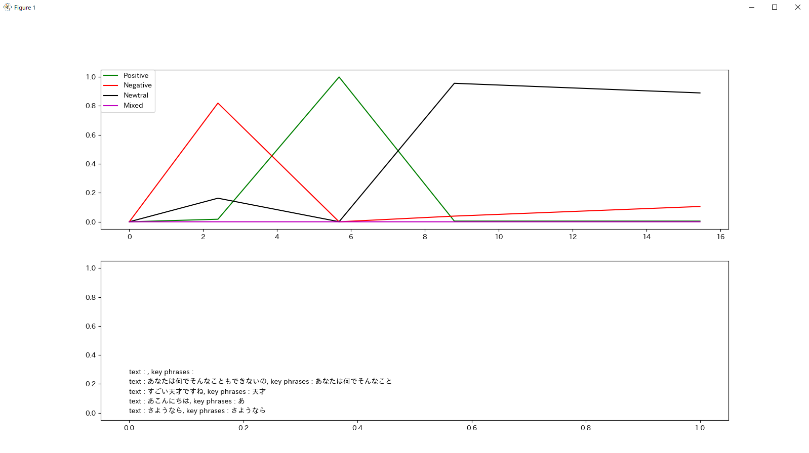

# transcribe-streaming-dashboard

## What's this

Transcribes your words from the microphone connected to your computer, performs emotion analysis and key phrase detection, and displays them on the dashboard.  
あなたのコンピュータに接続されているマイクから、あなたの言葉を文字に起こし、感情分析と、キーフレーズ検出を行い、ダッシュボードに表示します。


## Prerequirement

```shell
$ pip install -r ./requirements.txt
$ aws configure # Set up the IAM access key and other settings to use transcribe on your computer
```


## How to use it
```shell
$ python ./main.py
```


## config

The Tokyo region of AWS is used to transcribe the text in Japanese, but you can set it with arguments  
AWS の東京リージョンを使い、日本語で文字起こしをしますが、引数で設定できます

When using the Northern Virginia region for English transcription  
北部バージニアリージョンを使って英語の文字起こしを行う場合

```shell
$ python ./main.py --region us-east-1 --language-code 'en-US'
```

## caution
日本語が文字化けする場合は matplotlib の設定をよしなによろしくおねがいします。
